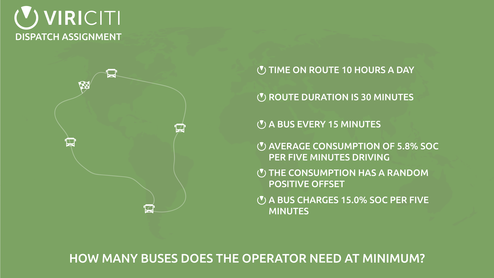

# Dispatch Assignment



### Introduction

ViriCiti is getting increasingly more involved with smart charging. Smart charging is about acheiving maximal efficiency for a fleet of vehicles that have limited available charging capacity. For programmers this is highly interesting. In light of these developments we have created a small assignment which will give you some insight into what ViriCiti is actually producing and, of course, help us assessing your programming skills.

### The assignment

Imagine you are developing a smart charging solution for a company's fleet of electric public transport buses. The operator of the fleet lets us know that the route they are going to drive takes 30 minutes (_routeTime_). He or she also tells us that the total amount of time buses are driving that route per day is 10 hours (_totalTime_). Now, the operator wants to achieve a minimum of 4 buses per hour, that is, have a bus depart each 15 minutes.

Now, if only buses had a large battery... then this would be an easy problem to solve. Unfortunately we still need to take into account the energy consumed while driving. This means that when a bus' state of charge (SOC) is below a certain value, there isn't enough capacity to drive the full route. Because of this, an operator needs to deploy extra buses while others are charging.

For simplicity's sake we assume that all these buses are identical. It is known that buses of these manufacturer have a battery that charges with a rate 5.0% SOC per 5 minutes. It is also known that these buses consume approximately 5.8% SOC per 5 minutes with a random positive deviation between 0 and 3.4. In the example we generate deviation like so: `5.8 + Math.random() * 1.7`.

How many buses does the operator need at minimum?

Hint: Assume that a bus is charging if it is not driving.
Hint: Possible variables you can use in the process are _routeTime_, _totalTime_, _progress_ (amount of minutes a bus has been driving), _onRoute_ (whether a bus is driving or not) and _soc_ (current state of charge of a bus).
Hint: Take into account extremes. What, considering the above scenario, is the worst possible case and how does it effect the conclusion?

### How to

To get you started, use this repository as a starting point. You can use it to finish the assignment. If desired, it is, of course also allowed to start over with a clean slate. In any case, mind the comments in our first sketch!

First, fork the repository at:
`https://github.com/viriciti/dispatch-assignment`

Then open up your terminal and clone the forked repository

Replace [YOUR_USERNAME] with your name
`git clone https://github.com/[YOUR_USERNAME]/assignment.git`

Enter the directory
`cd dispatch-assignment`

Run the project
`npm start`

You should see the following output

```
Time is flowing: 0 minutes passed.
Bus 1211 started
Time is flowing: 5 minutes passed.
Time is flowing: 10 minutes passed.
Time is flowing: 15 minutes passed.
...
...
```

### Important points

* Although it is nice if you accomplish to achieve to produce a definite end result, we are more interested in your general approach. This also means that you're javascript does not have to be perfect.

* Keep things as simple as you possibly can! Only then -- when there is time left -- you can expand and add details.

* We highly value clear code; the easier for us to understand what is going on the better. (e.g. create functions)

* Make sure that you can clarify important decisions and come up with some pros and cons.

* If there are any questions, remarks or mistakes in this repository / readme. Please don't hesitate to contact us or just create an issue here.

### Possible extras

* Make other parameters variable also. Think about _routeTime_, _totalTime_,

* Only dispatch the bus with the highest SOC, instead just any bus.

* Instead of adding buses manualy in your code, automise the trail and error process of finding the minimal amount of buses needed to perform the round trips.

* Use the [d3](https://d3js.org/) or [c3](http://c3js.org/) libraries to visualise input and output data.
